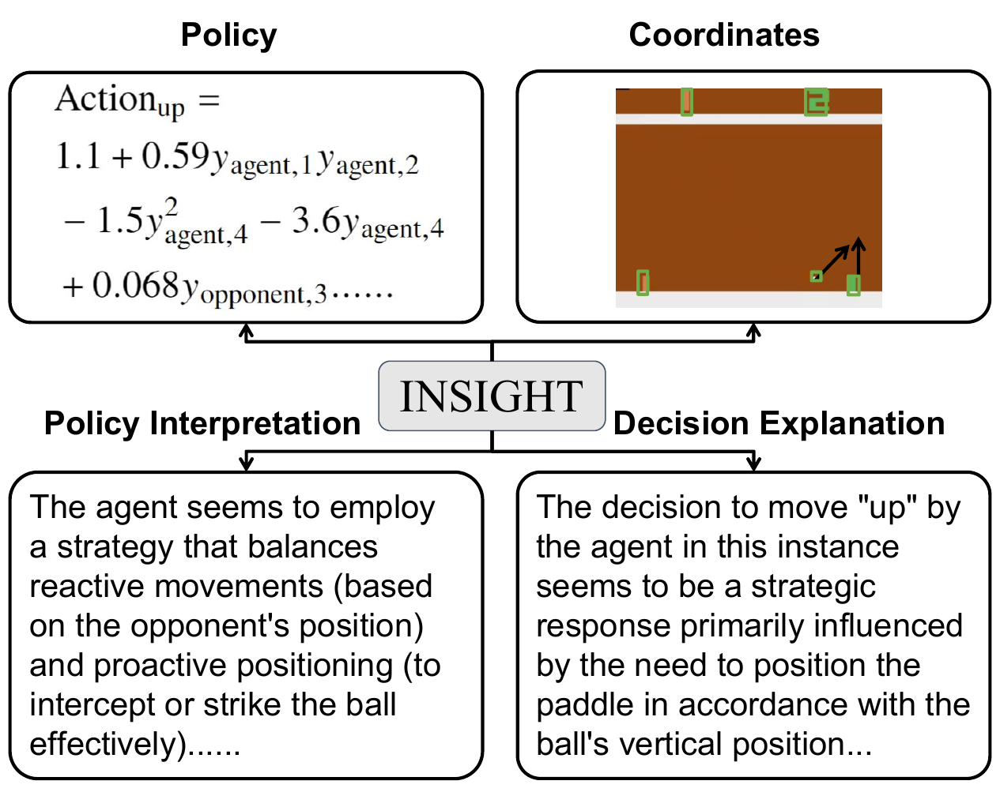
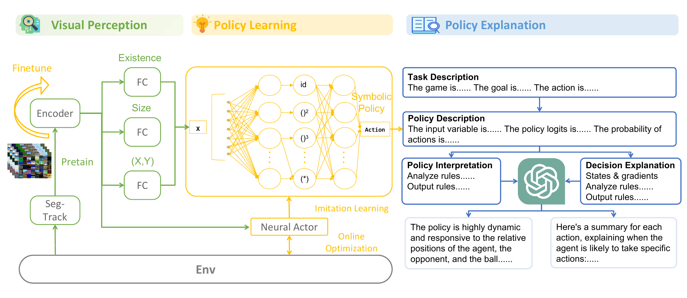
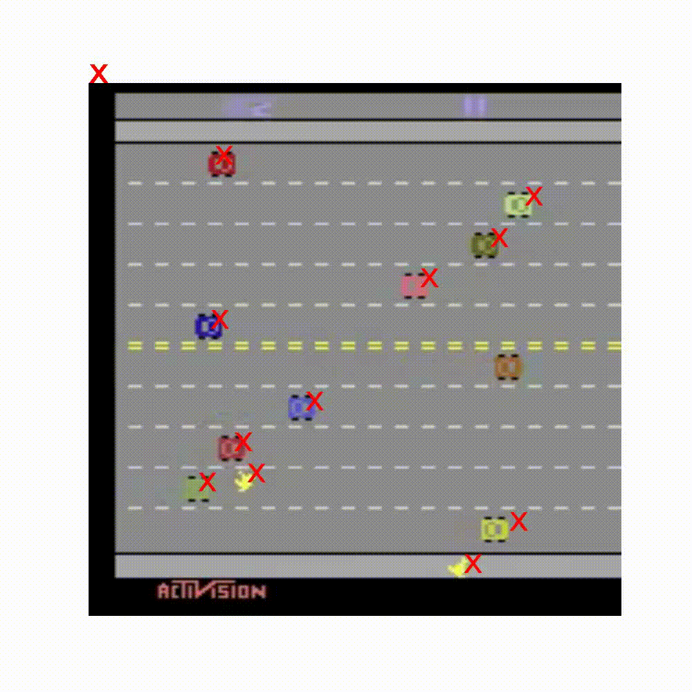
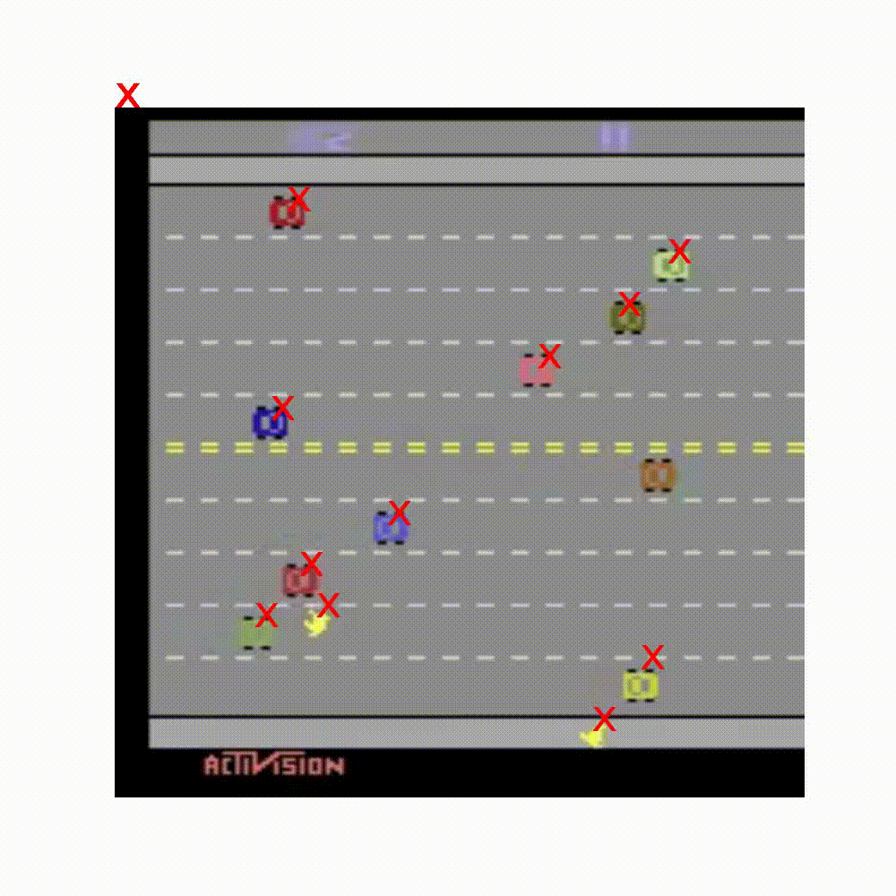

<div align="center">

# End-to-End Neuro-Symbolic Reinforcement Learning with Textual Explanations

### ICML 2024 (Spotlight)

**[Lirui Luo](https://liruiluo.github.io/), [Guoxi Zhang](https://guoxizhang.com/), [Hongming Xu](), [Yaodong Yang](https://www.yangyaodong.com/), [Cong Fang](https://congfang-ml.github.io/), [Qing li](https://liqing-ustc.github.io/)**


| [```Website```](https://ins-rl.github.io/) | [```Arxiv```](https://arxiv.org/abs/2403.12451) |
:------------------------------------------------------:|:-----------------------------------------------:|



</div>

---

# Abstract

Neuro-symbolic reinforcement learning (NS-RL) has emerged as a promising paradigm for explainable decision-making, characterized by the interpretability of symbolic policies.
NS-RL entails structured state representations for tasks with visual observations, but previous methods are unable to refine the structured states with rewards due to a lack of efficiency.
Accessibility also remains to be an issue, as extensive domain knowledge is required to interpret symbolic policies.
In this paper, we present a framework for learning structured states and symbolic policies jointly, whose key idea is to distill vision foundation models into a scalable perception module and refines it during policy learning.
Moreover, we design a pipeline to generate language explanations for policies and decisions using large language models.
In experiments on nine Atari tasks, we verify the efficacy of our approach, and we also present explanations for policies and decisions.

<div align="center">
<table>
<tr>
<td>

</td>
</tr>
<tr>
<th>
The INSIGHT framework.
</th>
</tr>
</table>
</div>

# Results


Here is the segmentation videos before and after policy learing on Freeway:

<div align="center">
<table>
<tr>
<td>

</img>

</td>
</tr>
<tr>
<th>
The video before.
</th>
</tr>
</table>
</div>

<div align="center">
<table>
<tr>
<td>

</img>
</td>
</tr>
<tr>
<th>
The video after.
</th>
</tr>
</table>
</div>

---

# Usage

## Installation

```bash
# core dependencies
conda env create -f environment.yml
conda activate insight
bash ./scripts/install.sh
# download
bash ./scripts/download_ckpt.sh
```

## Train INSIGHT

To generate dataset, use
```bash
bash scripts/dataset_generate.sh
```
To train cnn, use
```bash
bash scripts/train_cnn.sh
```
Or you can use a build-in [dataset](https://drive.google.com/file/d/1E_b3eBJ47ze1OJ7Nz1khsJ-q1YrcjTdu/view?usp=sharing) directly

To train policy, use 
```bash
bash scripts/train_policy_atari.sh
```

To train metadrive, use 
```bash
bash scripts/train_policy_metadrive.sh
```

Here is a report for INSIGHT: 

[Report](https://wandb.ai/liruiluo/nsrl-eql/reports/Pong--Vmlldzo4MzgxOTc3)


# Citation

If you find our code implementation helpful for your own research or work, please cite our paper.

```bibtex
@article{luo2024insight,
  title={End-to-End Neuro-Symbolic Reinforcement Learning with Textual Explanations},
  author={Luo, Lirui and Zhang, Guoxi and Xu, Hongming and Yang, Yaodong and Fang, Cong and Li, Qing},
  journal={ICML},
  year={2024}
}
```

# Contact

For any queries, please [raise an issue](https://github.com/liruiluo/nsrl-vision-pub/issues/new) or
contact [Qing Li](https://liqing-ustc.github.io/).

# License

This project is open sourced under [MIT License](LICENSE).
